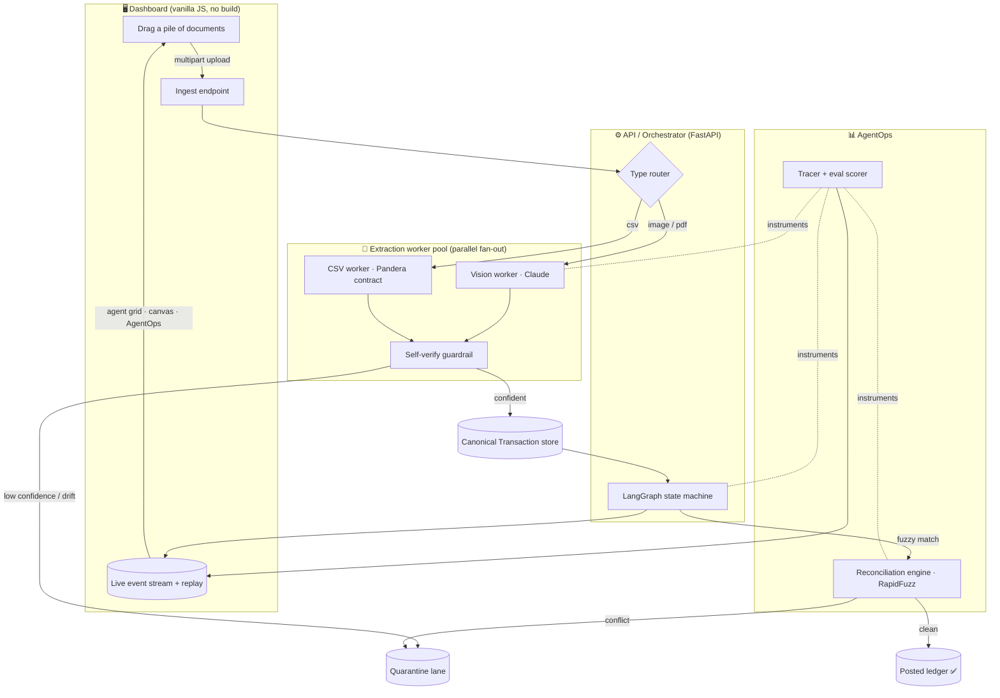
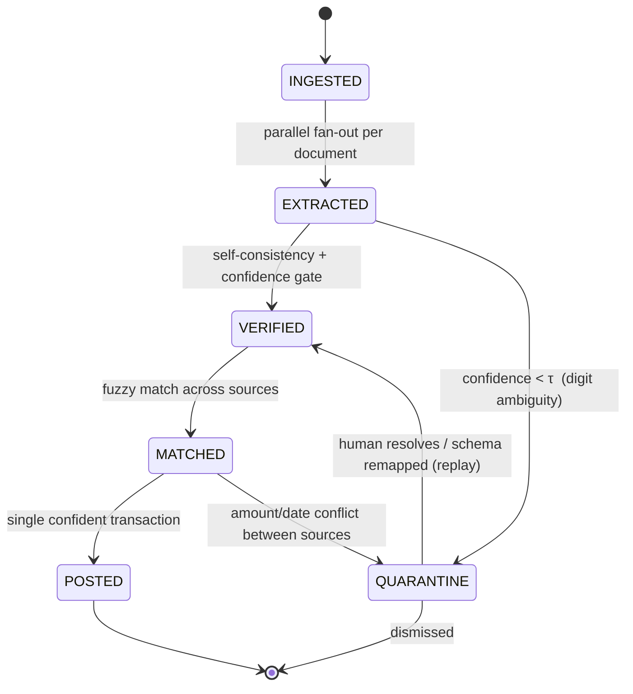
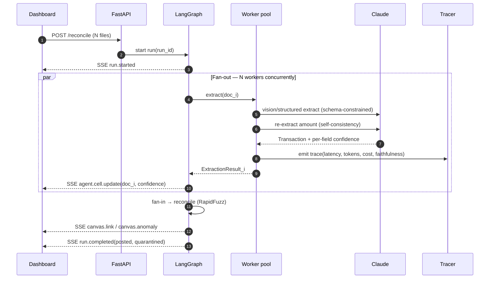
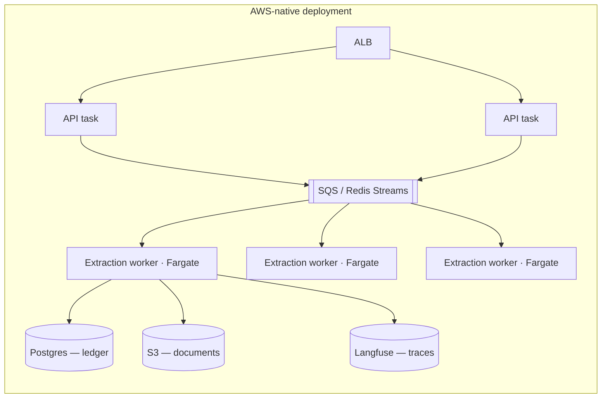
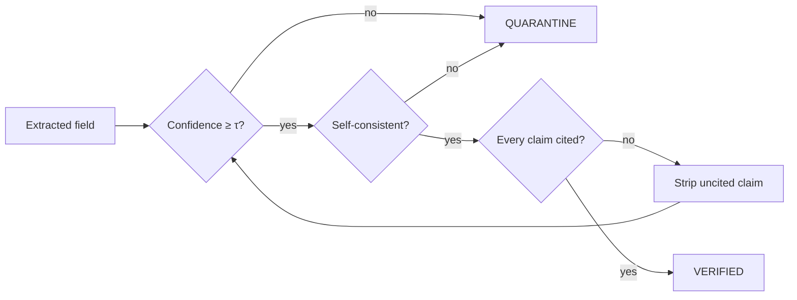

# Ledger Sentinel — System Architecture

> **Thesis:** Reconciling financial documents is not an OCR problem, it is a
> *trust* problem. The hard part is not reading a receipt — it is producing a
> merged ledger you can stake money on. So this system is designed around a
> single invariant: **no number is POSTED unless it can be proven; anything
> unproven is QUARANTINED, never silently dropped or guessed.**
>
> The LLM is used where it is strong (messy perception, fuzzy judgement) and
> fenced off everywhere it is weak (arithmetic, final authority) by
> deterministic guardrails. *The LLM proposes; deterministic code disposes.*

---

## 1. Problem framing & requirements

A person's spending is scattered across heterogeneous, contradictory sources:

| Source | Format | Failure characteristic |
|---|---|---|
| Bank / card statement | CSV | schema drifts silently (renamed columns, `MM/DD` ↔ `DD/MM`) |
| UPI app | screenshot (PNG) | partial info, no line items |
| Merchant receipt | photo / PDF | OCR digit errors (`450`→`480`), skew, glare |

The same purchase appears in 2–3 of these with **disagreeing amounts**, and naive
merging **double-counts**. The system must:

- **R1 — Extract** structured transactions from any of these formats.
- **R2 — Verify** each extraction and refuse to trust low-confidence reads.
- **R3 — Reconcile** across sources: link duplicates, surface conflicts.
- **R4 — Quarantine, not corrupt:** ambiguity routes to human review.
- **R5 — Be observable:** every decision is traced, scored, timed, costed (AgentOps).
- **R6 — Be operable:** containerized, horizontally scalable, degrades gracefully.

### Non-goals
Full accounting/double-entry bookkeeping, multi-currency FX, and bank API
integrations are explicitly out of scope for v1 — they are additive and would
dilute the core demonstration of *trustworthy autonomous reconciliation*.

---

## 2. System overview



**Data flow in one sentence:** upload → type-routed **parallel** extraction →
self-verification gate → fan-in to canonical store → reconciliation → state
machine routes each transaction to POSTED or QUARANTINE → every hop emitted as a
trace event to the dashboard.

---

## 3. The reconciliation state machine

Orchestration is a **LangGraph** graph. We chose a graph over an ad-hoc `async`
script for three concrete reasons: (1) built-in **checkpointing** gives us replay
and an audit trail for free (R5/R6); (2) conditional edges make the quarantine
branches explicit and testable; (3) state is a typed object, not scattered
locals.



**Why a state machine and not a prompt chain?** Each transition is a *guard*, not
a suggestion. `VERIFIED` is only reachable if deterministic checks pass; the model
cannot "talk its way" into POSTED. This is the structural difference between a
demo and a system you would let touch real money.

---

## 4. The extraction request lifecycle (sequence)



The `par` block is the heart of the performance story: workers are stateless and
independent, so wall-clock latency is bounded by the **slowest single document**,
not the sum.

**Run durability (decoupled execution).** The run is launched by `POST /reconcile`
and runs to completion as a background task — *independent of whether any browser
is connected*. The SSE endpoint is a pure **tailer** over a per-run replay buffer
(see `events.EventBus`): on connect it replays the full event history, then streams
live. This eliminates a whole class of races — "the dashboard subscribed a moment
too late and the run looks hung / empty forever" — and means the result is durably
fetchable from `/runs/{id}` even if the client never opened the stream. In
production this same contract is provided by Redis Streams / an SQS consumer group
(replay + at-least-once) with no change to callers. See failure mode **F8**.

---

## 5. The contract: canonical data model

All sources are normalized to one Pydantic schema. This schema *is* the
integration contract — it is the only thing the reconciliation engine sees, which
is what lets us add a new source (e.g. a PDF invoice) without touching the engine.

```python
class FieldConfidence(BaseModel):
    value: float            # 0..1, model-reported + calibrated
    method: str             # "self_consistency" | "schema" | "ocr_agreement"

class Transaction(BaseModel):
    id: str
    source_doc: str
    source_type: Literal["receipt", "bank_csv", "upi_screenshot"]
    merchant: str
    amount: Decimal         # Decimal, never float — money is exact
    currency: str = "INR"
    txn_date: date
    confidence: dict[str, FieldConfidence]
    state: Literal["EXTRACTED","VERIFIED","MATCHED","POSTED","QUARANTINE"]
    evidence: list[str]     # crop refs / source rows backing every claim
```

Two deliberate choices: **`Decimal` not `float`** (financial correctness), and an
**`evidence` trail on every record** (so a QUARANTINE flag can always show *why*).

---

## 6. Scale considerations

The local stack (`docker compose up`) and the production topology are the *same
shape* — stateless API + worker pool — so scaling is a matter of swapping
in-process primitives for managed ones, not redesigning.



| Dimension | Local (v1) | Production path |
|---|---|---|
| **Fan-out** | `asyncio` + bounded semaphore | SQS/Redis Streams + Fargate worker pool, autoscaled on queue depth |
| **State / checkpoint** | LangGraph in-memory saver | LangGraph Postgres checkpointer (durable replay across restarts) |
| **Ledger store** | SQLite | Postgres (RDS), partitioned by user |
| **Documents** | local disk | S3 + presigned uploads (keep large blobs off the API path) |
| **Throughput knob** | `LEDGER_MAX_CONCURRENCY` | worker replica count |

**Back-of-envelope:** at ~3s/document extraction and 8 concurrent workers, one
worker task clears ~160 docs/min. Because extraction is embarrassingly parallel
and stateless, throughput scales linearly with worker replicas until the upstream
model rate limit — at which point the bottleneck is *quota*, addressed below
under cost/model-routing, not architecture.

---

## 7. Latency trade-offs (the decisions worth defending)

1. **Parallel fan-out vs. sequential.** Sequential is simpler but latency is
   `Σ(docs)`. Fan-out makes it `max(docs)` at the cost of concurrency control and
   harder tracing. We pay that cost — a 17-document pile goes from ~50s to ~4s.
   The bounded semaphore (`LEDGER_MAX_CONCURRENCY`) prevents us from melting the
   model rate limit while fanning out.

2. **Self-consistency double-extraction vs. single pass.** Extracting each amount
   twice ~doubles per-field token cost on *amounts only*. We accept it because the
   #1 failure (silent digit misread) is invisible without it — a wrong number that
   *looks* confident is worse than a slow one. This is a latency-for-trust trade.

3. **Two-tier model routing (latency × cost × accuracy).** Clean documents go to
   a fast model (`LEDGER_MODEL_FAST`); only low-confidence/ambiguous ones escalate
   to the deep model (`LEDGER_MODEL_DEEP`). ~80% of docs never need the expensive
   path, so p50 latency and cost track the *fast* model while accuracy on the hard
   20% tracks the *deep* one.

4. **SSE vs. WebSocket for live updates.** The dashboard only needs
   *server→client* streaming. SSE is one-directional, survives proxies, and
   auto-reconnects — strictly simpler than WebSocket for this access pattern, with
   no feature we'd miss.

---

## 8. Failure modes & hardening (AgentOps + guardrails)

This is the section that separates a script from a system. For each natural
failure we name the guardrail and where it lives in code.

| # | What naturally breaks | Guardrail / state-machine response | Lives in |
|---|---|---|---|
| F1 | **Vision misreads a digit** (`₹450`→`₹480`) | Amount extracted twice; if the two reads disagree → `QUARANTINE`, never posted | `extraction/verify.py` |
| F2 | **Same purchase double-counted** across sources | Reconciliation fuzzy-matches `amount×date×merchant`; duplicates collapse to one linked entry | `graph/matching.py` |
| F3 | **Cross-source amount conflict** (receipt ₹450 vs statement ₹540) | Match found but amounts disagree → `ANOMALY` → `QUARANTINE` with both values + evidence | `graph/reconciliation.py` |
| F4 | **Hallucinated field** (invented merchant/date) | Output is schema-constrained; every claim must cite `evidence`; uncited claims stripped pre-`VERIFIED` | `schemas.py` + `verify.py` |
| F5 | **Bank CSV schema drift** (renamed/reordered column) | Pandera contract validates headers/types; on drift, rows go to `QUARANTINE` and a remap is proposed, then **replayed** — no crash, no corruption | `extraction/csv_ingest.py` |
| F6 | **Model API failure / rate limit** | Retry w/ exponential backoff + jitter (`LEDGER_MAX_RETRIES`); transient 429/5xx/timeout are retried, then the doc **degrades to the deterministic parser** — if that read is itself low-confidence, the verify gate quarantines it. The run always completes | `extraction/vision.py` |
| F7 | **No API key at all** | Deterministic **mock mode** replays canned extractions so the system — and the live demo — never hard-fails | `config.py` |
| F8 | **Dashboard connects late, SSE drops, or is blocked by a proxy** | Run execution is **decoupled from streaming**: it launches on `POST /reconcile` and completes regardless of who's watching. The event bus keeps a **per-run replay buffer**, so a late/reconnecting subscriber receives full history then tails live; if SSE can't connect at all, the client **falls back to polling** `/runs/{id}`. A failed run emits `run.failed` rather than hanging | `events.py` + `main.py` + `frontend/app.js` |

### The validation state machine, precisely



> **Design principle restated:** the model can only ever *propose* a transition.
> Deterministic guards (`τ`, self-consistency, citation, Pandera) decide whether
> it actually happens. That asymmetry is what makes the autonomy safe.

### AgentOps: what we measure

Every node emits a trace span carrying: `latency_ms`, `input/output_tokens`,
`usd_cost`, `model`, and an eval score. The per-span eval is **faithfulness** —
does the extracted value have backing evidence? — computed deterministically from
the `evidence` field, not by asking another LLM (grading an LLM with an LLM just
stacks uncertainty). These stream to the dashboard's AgentOps tab and (if
configured) persist to Langfuse for historical dashboards and regression datasets.

### Evals & release gates (the discipline, not just the dashboard)

> *You cannot improve what you do not measure — and for a system that touches
> money, the metric that matters is not accuracy, it's **quarantine recall**: did
> we catch everything we were supposed to refuse to post?*

Tracing tells you what *one run* did. **Evals** tell you whether the system is
still correct after a change. `backend/evals/` runs the real extraction +
reconciliation paths over a hand-labeled **golden set** (`evals/dataset.py`) and
scores three layers of truth, then **gates** on them:

| Metric | What it proves | Gate |
|---|---|---|
| `amount_exact_rate` | every amount was read exactly (no silent digit drift) | ≥ 1.0 |
| `quarantine_recall` | **safety** — nothing un-postable slipped through | ≥ 1.0 |
| `quarantine_precision` | humans aren't drowned in false quarantines | ≥ 1.0 |
| `link_f1` | exactly the right duplicates/anomalies were found | ≥ 1.0 |
| `confidence_gate_separation` | posted items are *strictly* more confident than low-confidence quarantines (calibration sanity) | > 0 |

The scorecard also reports **guardrail attribution** — which guard caught each
quarantine. On the golden set, the BREW & CO conflict is caught by the
*reconciliation* guard (2 rows) while CAFE ZEST is caught by the *confidence* guard
(1 row), proving the two guardrails are independent and both load-bearing. In mock
mode the whole eval is deterministic, so these thresholds are an executable
contract: `pytest tests/test_evals.py` turns a silent quality regression into a red
build. Run it live with `python -m evals.run`.

---

## 9. Security & data governance

- **PII at rest:** financial documents are sensitive. Locally they stay on disk;
  in prod they live in S3 with SSE-KMS and short-lived presigned URLs — the API
  never holds the blob.
- **No silent egress:** the only external call is to the model provider, and only
  document *content* needed for extraction is sent; nothing is logged in cleartext
  to traces (trace payloads carry derived fields + crop refs, not raw images).
- **Human-in-the-loop gate:** the `QUARANTINE → VERIFIED` transition requires an
  explicit human resolution — the system never auto-approves its own uncertainty.

---

## 10. Technology choices — and the alternative I rejected

| Decision | Chosen | Rejected alternative | Why |
|---|---|---|---|
| Orchestration | LangGraph | hand-rolled `async` chain | checkpointing, replay, explicit guarded edges, audit trail |
| Extraction | Claude vision, schema-constrained | standalone OCR (Tesseract/Paddle) | OCR returns text, not *structured + confidence-scored* fields; reconciliation needs the latter |
| CSV integrity | Pandera contract | trust-the-headers parsing | drift is the #1 real-world breakage; a contract turns a 3am crash into a quarantine |
| Matching | RapidFuzz (deterministic) | LLM "are these the same?" | matching must be fast, cheap, explainable, and unit-testable — not a token spend |
| Money type | `Decimal` | `float` | float arithmetic on currency is a correctness bug, not a style choice |
| Live updates | SSE | WebSocket | one-directional stream; simpler, proxy-friendly, auto-reconnect |
| Observability | Langfuse (optional) + in-proc tracer | print logging | evals + traces are the differentiating "AgentOps" signal; in-proc fallback keeps it dependency-light |

---

## 11. What I'd build next (honest roadmap)

- **Confidence calibration:** the eval scorecard already checks confidence
  *separation* (posted vs low-confidence quarantines); the next step is full
  calibration against a larger labeled set (reliability curve / ECE) so `τ` is
  principled, not chosen. The harness in `backend/evals/` is where that lands.
- **Active-learning loop:** every human QUARANTINE resolution becomes a new golden
  row → expands the eval set → a regression gate → measurable extraction
  improvement over time. The gated scorecard is the foundation this builds on.
- **Durable checkpointer + queue:** swap in Postgres checkpointer and SQS to make
  runs resumable across restarts (the production path in §6).
- **Receipt line-item reconciliation:** match at the line-item level, not just the
  transaction total.
